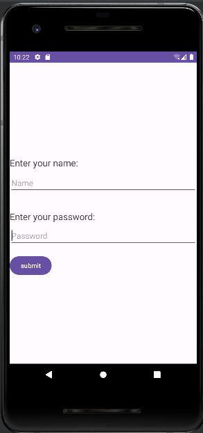
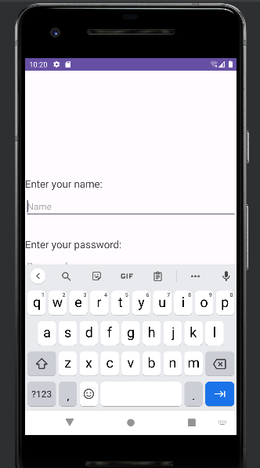
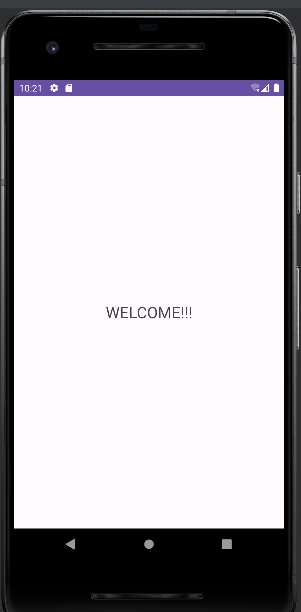

# Android Login Page


## Description
This Android application showcases a simple login page where users can enter their username and password. Upon successful submission, the app navigates to a new page displaying a "WELCOME" message.

## Features
- Username and password input fields
- Submit button for submission
- Navigation to a new page upon successful login

## Screenshots/GIFs




## Technologies Used
- Android Studio
- Java/Kotlin

## Installation
To run this project locally, follow these steps:
1. Clone the repository:
   ```bash
   git clone https://github.com/your-username/login-page.git
Open the project in Android Studio.
Build and run the app on an emulator or a physical Android device.
Usage
Once the app is running:

Enter a username and password in the respective input fields.
Click on the "Submit" button.
Experience the navigation to the new page displaying the "WELCOME" message.
